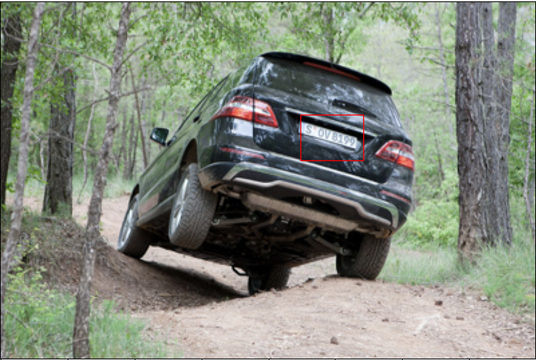

# ALPR

Automatic License Place Recognition.

We use the following dataset: https://www.kaggle.com/datasets/andrewmvd/car-plate-detection/data

Step 1: Detect the license plate in the image using Yolo Tiny v4.

- We use this collab https://colab.research.google.com/drive/1zi0m3pE3KcWyKATRhqo4wTCSqglzLG3u?usp=sharing to train the model.

Step 2: Extract the license plate from the image using homography.

- see the `̀detection.ipynb` notebook.

Step 3: Recognize the license plate using Tesseract OCR.

- Coming soon.