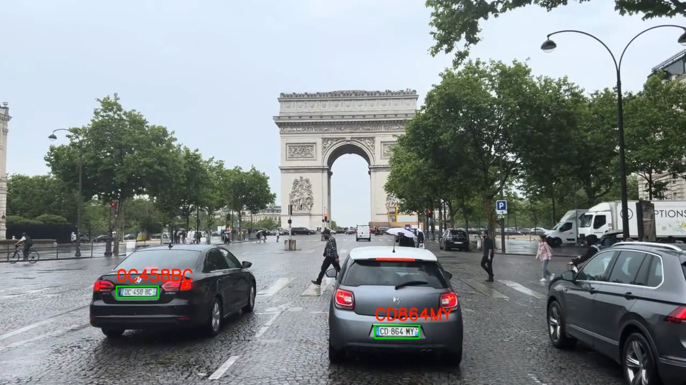

# ALPR

This is the repository of our final project for the X-INF573 course at École Polytechnique.

The goal was to perform realtime automatic european license plate recognition on a video stream in order to match the license plates with a list of potential targets.



## Dataset

The dataset we used is an aggregate of these 3 datasets:

Romanian license plates: https://github.com/RobertLucian/license-plate-dataset

French license plates: https://github.com/qanastek/FrenchLicencePlateDataset

PP4AV (Paris + Strasbourg): https://huggingface.co/datasets/khaclinh/pp4av

## Features

### Image processing

To process a single image, use `alprLib/singleImage.py` like this:

```sh
python3 singleImage.py <path_to_image>
```

The `testImages` folder contains some images you can use to test the script.

### Video processing

You can process videos both in an offline and realtime fashion. 

- For realtime processing use `alprLib/cameraStream.py`

- For offline processing use `alprLib/videoToVideo.py`

For offline processing, one video is available in the `testVideos` folder. You can process it like this:

```sh
python3 videoToVideo.py testVideos/test.mp4 testVideos/test_out.mp4
```


### Plate detection

We trained a highly performant and accurate YoloV4 Tiny model to detect license plates in images.

The model is abstracted in the `Yolo` class inside `alprLib/yolo.py`. Alternative weights can be found inside the `yolo_weights` folder.

Our model was trained on google colab using this notebook: https://colab.research.google.com/drive/1zi0m3pE3KcWyKATRhqo4wTCSqglzLG3u?usp=sharing You can use it to train your own model.

### Plate extraction

Perspective correction and upscaling can be used independently using `alprLib/Perspective.py` and `alprLib/upscale.py`. Upscaling models are available in the `alprLib/super_resolution` folder.

### Plate recognition

The `TextOCR` class from `alprLib/TextOCR.py` is a backend agnostic class that can be used to recognize text in images with either EasyOCR or Tesseract.

It performs upscaling using `ESPCN`, alternative models can be found inside the `alprLib/super_resolution` folder.

### Plate matching

We also provide a utility to match the output of the OCR with a list of target license plates using the Levenshtein distance in `alprLib/comparePlate.py`.